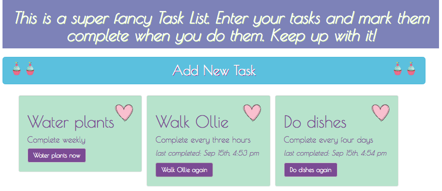
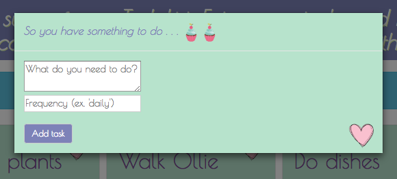

# Life Help

#### _React JS Independent Project for Epicodus, September 15th, 2017_
**_By Calla Rudolph_ [(e-mail me here)](<mailto:callarudolph@gmail.com>)**

## Description
This ReactJS app was created to help the user keep track of daily life tasks, such as watering plants or doing the dishes. The user can input a new task with a recommended frequency for completion. Once the task has been completed, the user can click a button to mark a timestamp. When the user has completed the task again, the button can be pressed again to update the completed timestamp.

_The purpose of this app was to practice pure and stateful components with PropTypes._

## Integration

* The App component will import both Header and Life components.
* The Header component will display a brief introduction to the app.
* The Life component will import both NewTaskControl and TaskList components, as well as hold the masterTaskList.
* The NewTaskControl component will import the NewTaskForm, which will toggle a modal to allow the user to add new tasks.
* The TaskList component will import the Task component to display each individual task.
* The Task component will import the CompletedTask component to render the completed button and timestamp.

## Prerequisites
* [Node.js](https://nodejs.org/) (with NPM)

## Installation Instructions
* Open Terminal and type:
* `$ cd Desktop`
* `$ git clone https://github.com/CallaRudolph/life-help`
* `$ cd life-help`
* `$ npm install`
* `$ atom .`

### Serving Program
* In Terminal, run `$ npm run start`
* In your Browser (Chrome preferred) navigate to [http://localhost:8080/](http://localhost:8080/)

## Future Functionality
* Add background image to app.
* Count down to when the task needs to be completed again.
* In the countdown, if the task needs to be completed _soon_, or is overdue, its entry in the list should visually differentiate itself from the other entries with varying text color.
* Sort the list of tasks so that the tasks that needs to be completed next is always on top.
* If the user attempts to complete the task _before_ it's due, display a warning alert.

## Technologies Used
* [Node.js](https://nodejs.org/) (with NPM)
* [ReactJS](https://facebook.github.io/react/)
* [Webpack](https://webpack.js.org/)
* [Babel](https://babeljs.io/)
* [MomentJS](https://momentjs.com/)
* Bootstrap/CSS
* HTML

## License Information
Copyright &copy; 2017 Calla Rudolph

_Please email me at the above address with any comments or improvements you have found!_

This software is licensed under the MIT license.
